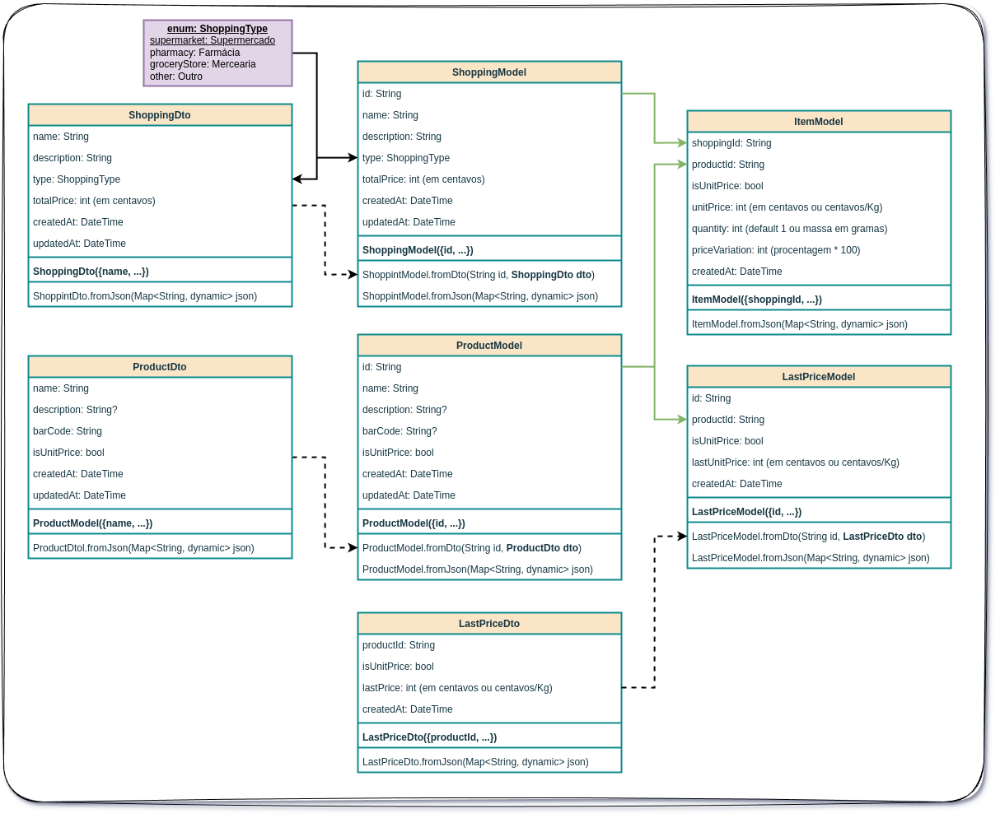
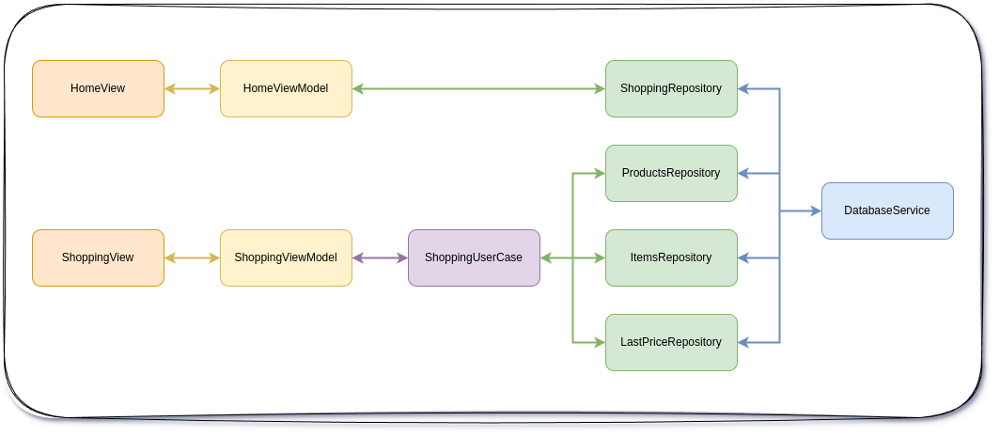

# Compras

Esta aplicação é uma antiga demanda de minha Ex (Jeani Daniela Bortolini) para o controle das compras em mercados, farmácias e outros.

A ideia do aplicativo é registrar os itens comprados e o valor total da compra. Verificar as alterações nos preços dos produtos e de suas compras mensais.

A aplicação será implementada com a arquitetura proposta pelo time do Flutter MVVM.

## Diagrama de Classes

O diagrama de classes abaixo ilustra o padrão de arquitetura utilizado na aplicação.

- **ShoppingModel** representa o modelo de dados da compra, contendo os itens e o valor total.

- **ProductModel** representa o modelo de dados do produto, contendo o nome, descrição, código de barras, parâmetro para indicar que o produto é vendido a unidade ou a quilo. Futuramente estes dados devem ser alimentados por API externa, buscando informações dos produtos em uma base de dados pelo seu código de barras.

- **ItemModel** representa o modelo de dados do item da compra, contendo o produto, a quantidade e o preço unitário.

- **LastPriceModel** representa o modelo de dados do preço do produto, contendo o produto, a data e o preço unitário das últimas compras.

Alguns dtos (Data Transfer Objects) foram criados para facilitar a passagem de informação entre as camadas de domínio e data.

## Arquitetura MVVM

O projeto vai ser desenvolvido com a arquitetura proposta pelo time do Flutter MVVM, em três camadas básicas:

- **Data Layer**: camada para os *repositories* e *services*. 
    - o *repository* é a fonte de verdade (*source of truth*) de dados, mantendo o cache e podendo ser reativo para mudanças nos dados armazenados. 
    - O *service* implementa uma abstração sobre tecnologia da base de dados.
- **Domain Layer**: camada para os *models* e *user-cases*.
    - Os *models* representam os dados que serão armazenados no banco de dados.
    - Os *user-cases* são implementados para:
        - regras de negócio complexas
        - acesso a mais de um *repository*
        - quando um *repository* precisa ser acessados por diversas uis, a fim de evitar duplicação de código.
- **UI Layer**: camada para as *views* e *view-models*.
    - As *views* representam as telas da aplicação.
    - Os *view-models* implementam a lógica de negócio das *views*, conectando as *views* aos *repositories*, ou aos *user-cases* nos casos declarados acima.

Para a implementação são pevistos os dois ramos principais na arquitetura:

1. **DatabaseService <-> ShoppingRepository <-> HomeViewModel <-> HomeView** - neste ramo será gerenciado a view principal do app, onde o usuário pode ver e editar as compras cadastradas.
2. **DatabaseService <-> ProductRepository/ItemsRepository/LastPriceRepository <-> ShoppingViewModel <-> ShoppingView** - neste ramo serão gerenciadas as views de cadastro de compras, cadastro de produtos e cadastro de preços dos produtos durante uma compra.

A ideia é que as compras sejam geristradas e que os itens lançados possam ter seus preços anteriores apresentados durante a inserção, para fim de comparação e levantamento de sua inflação de preços durante a compra.

Para mais detalhes da arquitetura veja o texto em [ARCHITETURE.md](ARCHITECTURE.md) e a documentalção do Flutter Team.

# Changelog

## 2025/06/27 last_price_repository-01 - by rudsonalves

### Extend SQLite boolean handling and add LastPrice repository/tests

This commit refines SQLite integer-to-boolean conversion via a new `SqliteHelpers` utility, updates schema columns for `is_unit_price` fields, and integrates a full-featured LastPrice repository with corresponding interfaces and unit tests. Repository interfaces for items now include `totalPrice()`, and the shared `Result` class gains success/failure flags.

### Modified Files

* **docs/Diagrama\_de\_Classes.drawio**

  * Updated internal diagram dimensions to match the latest class revisions.

* **docs/images/Diagrama\_de\_Classes.png**, **docs/images/MVVM.png**

  * Replaced with refreshed exports reflecting updated column and model changes.

* **lib/data/repositories/items/i\_items\_repository.dart**

  * Added `totalPrice()` signature to the items repository interface.

* **lib/data/repositories/items/items\_repository.dart**

  * Implemented `@override totalPrice()` annotation for consistency.

* **lib/data/services/database/tables/sql\_tables.dart**

  * Changed DDL default types for `is_unit_price` from BOOLEAN to INTEGER (0/1).

* **lib/domain/dto/last\_price/last\_price\_dto.dart**

  * Introduced `fromJson`/`toJson` converters (`SqliteHelpers`) on `isUnitPrice` key.

* **lib/domain/dto/product/product\_dto.dart**

  * Applied same integer-to-boolean converters to `ProductDto.isUnitPrice`.

* **lib/domain/models/item/item\_model.dart**

  * Added JSON converters on `ItemModel.isUnitPrice`.

* **lib/domain/models/last\_price/last\_price\_model.dart**

  * Applied converters to `LastPriceModel.isUnitPrice`.

* **lib/domain/models/product/product\_model.dart**

  * Integrated converters on `ProductModel.isUnitPrice`.

* **lib/utils/result.dart**

  * Introduced `isSuccess` and `isFailure` getters to simplify result checking.

* **pubspec.yaml**

  * Added `sqflite_common_ffi` dependency for desktop testing and `path_provider`.

### New Files

* **lib/domain/models/sqlite\_helpers.dart**
  Utility class for converting between Dart `bool` and SQLite integer (0/1).

* **lib/data/repositories/last\_price/i\_last\_price\_repository.dart**
  Repository interface defining CRUD operations for last-price entries.

* **lib/data/repositories/last\_price/last\_price\_repository.dart**
  Concrete implementation managing in-memory cache and database persistence of last-price records.

* **test/data/repositories/products/products\_repository\_test.dart**
  Integration tests for `ProductsRepository` using in-memory SQLite via `sqflite_common_ffi`.

* **test/data/repositories/shopping/shopping\_repository\_test.dart**
  Integration tests for `ShoppingRepository` with desktop SQLite support.

### Conclusion

All changes for integer-based boolean handling and the new LastPrice feature are in place, and comprehensive tests confirm full functionality.

## 2025/06/27 structural_adjustments-01 - by rudsonalves

### Add last-price tracking and unit-price support across data models

This commit extends the shopping app’s data model and persistence layer to support “last price” records and unify unit-based pricing. Schema definitions, repositories, DTOs, and domain models have been updated accordingly, and documentation (README and class diagrams) reflects these enhancements.

### Modified Files

* **README.md**

  * Expanded project description with MVVM architecture overview.
  * Added class- and MVVM-diagram image references.
  * Clarified three-layer structure (Data, Domain, UI) and main architectural branches.

* **docs/Diagrama\_de\_Classes.drawio**

  * Adjusted `mxGraphModel` dimensions to match updated diagrams.

* **lib/data/repositories/items/items\_repository.dart**

  * Renamed `prince` → `unitPrice` field.
  * Updated `totalPrice()` to use `unitPrice` instead of legacy `prince`.

* **lib/data/services/database/database\_service.dart**

  * Included execution of `lastPrices` table and its index in batch setup.
  * Added grouping comments for “Tables” and “Indexes”.

* **lib/data/services/database/tables/sql\_tables.dart**

  * Added `last_price` table DDL and index.
  * Introduced `is_unit_price`, `unit_price`, and `created_at` columns for `items`.
  * Added `is_unit_price` flag to `products`.

* **lib/domain/dto/product/product\_dto.dart**

  * Added `isUnitPrice` boolean (default `true`) to `ProductDto` fields and factory.

### New Files

* **docs/images/Diagrama\_de\_Classes.png**
  PNG export of the updated class diagram.

* **docs/images/MVVM.png**
  Visualization of the MVVM architecture branches.

* **lib/domain/dto/last\_price/last\_price\_dto.dart**
  Freezed DTO for “last price” records, including `productId`, `isUnitPrice`, `lastUnitPrice`, and `createdAt`.

* **lib/domain/models/last\_price/last\_price\_model.dart**
  Domain model for “last price” entries with factory constructors and JSON support.

### Assets and Test Data

* **Diagram Images**

  * `docs/images/Diagrama_de_Classes.png`
  * `docs/images/MVVM.png`

### Conclusion

All enhancements for last-price tracking and unit-based pricing are in place, and the application is now fully functional.

## 2025/06/27 home_view-test-01 - by rudsonalves

### Update class diagram, dependency injection, repositories, DTOs, and UI enhancements

This commit refines the class diagram geometry, modernizes dependency registration to use `ChangeNotifierProvider`, enriches repositories with notification support, adds default values and nullability to DTOs, introduces rich UI interactions in the Home view (including swipe-to-edit/delete and a shopping list tile), embeds new enum icons, and extends the diagram with a `LastPriceModel` swimlane.

### Modified Files

* **docs/Diagrama\_de\_Classes.drawio**

  * adjusted `dx`/`dy` values, swimlane geometries, and edge point arrays
  * highlighted `ShoppingDto`/`ProductDto` parameters in bold
  * added `LastPriceModel` swimlane with fields and repository edges
* **lib/config/dependencies.dart**

  * replaced dual `Provider<IShoppingRepository>` with a single `ChangeNotifierProvider<ShoppingRepository>`
  * commented out legacy interface provider
* **lib/data/repositories/shopping/shopping\_repository.dart**

  * extended `ShoppingRepository` from `ChangeNotifier`
  * added `notifyListeners()` on insert, update, delete, and load
  * imported `flutter/material.dart` to support `ChangeNotifier`
* **lib/domain/dto/shopping/shopping\_dto.dart**

  * moved `totalPrice` default into constructor, removed explicit `required`
* **lib/domain/enums/enums.dart**

  * added `IconData iconData` to `ShoppingType` enum entries
  * imported `material_symbols_icons`
* **lib/routing/router.dart**

  * reordered imports, read repository via `ctx.read<ShoppingRepository>()`
  * aligned builder contexts (`ctx` vs `context`)
* **lib/ui/view/home/home\_view\.dart**

  * wired `HomeViewModel.delete` listener for delete feedback
  * wrapped body in `ListenableBuilder` showing loading, empty state, or `ListView`
  * implemented swipe-to-edit and swipe-to-delete via `Dismissible`
* **lib/ui/view/home/home\_view\_model.dart**

  * switched from interface to `ShoppingRepository` dependency
  * initialized `load` immediately and added `delete` command
  * exposed `shoppings` and `notifier` from repository
* **lib/ui/view/new\_shoppint/new\_shopping.dart**

  * switched to `ShoppingDto.create(...)` factory
* **lib/ui/view/new\_shoppint/new\_shopping\_view\_model.dart**

  * removed artificial 2 s delay after save
* **lib/domain/dto/shopping/shopping\_dto.freezed.dart** and **.g.dart**

  * no manual edits (regenerated by build runner)

### New Files

* **lib/ui/view/home/widgets/shopping\_list\_tile.dart**
  Stateless widget displaying each shopping entry with leading icon, title, subtitle, formatted date, price label, and swipe actions for edit/delete.

### Conclusion

All components are now reactive with provider notifications, DTOs are safer with defaults and nullability, and the UI supports robust list interactions—system is ready for further feature development.

## 2025/06/26 home_view-04 - by rudsonalves

### Add nullable timestamps, default values, NewShopping feature, and build runner command

These changes enhance data handling by making `createdAt`/`updatedAt` fields nullable and providing default values, streamline development with a new `run_build_runner` target, and introduce a complete “New Shopping” flow. UI components, routing, and theming adjustments ensure consistency and usability across the app.

### Modified Files

* **Makefile**

  * appended a `run_build_runner` target to watch code generation
* **docs/Diagrama\_de\_Classes.drawio**

  * adjusted geometry coordinates and updated swimlane labels for consistency
* **lib/config/dependencies.dart**

  * removed duplicate `IShoppingRepository` provider registration
* **lib/domain/dto/product/product\_dto.dart**

  * changed `createdAt`/`updatedAt` to nullable
* **lib/domain/dto/product/product\_dto.freezed.dart**

  * updated copyWith and constructor signatures to accept nullable timestamps
* **lib/domain/dto/product/product\_dto.g.dart**

  * added null checks when parsing/serializing JSON dates
* **lib/domain/dto/shopping/shopping\_dto.dart**

  * introduced default `totalPrice` of 0 and made timestamps nullable
* **lib/domain/dto/shopping/shopping\_dto.freezed.dart**

  * adjusted generated code for default value and nullable fields
* **lib/domain/dto/shopping/shopping\_dto.g.dart**

  * support null JSON timestamps and default `total_price`
* **lib/domain/models/product/product\_model.dart**

  * made `createdAt`/`updatedAt` nullable
* **lib/domain/models/product/product\_model.freezed.dart**

  * updated generated code to handle nullable timestamps
* **lib/domain/models/product/product\_model.g.dart**

  * added null checks in JSON parsing/serialization
* **lib/domain/models/shopping/shopping\_model.dart**

  * made `createdAt`/`updatedAt` nullable
* **lib/domain/models/shopping/shopping\_model.freezed.dart**

  * updated generated code for nullable timestamps
* **lib/domain/models/shopping/shopping\_model.g.dart**

  * handle optional JSON date fields
* **lib/routing/router.dart**

  * imported and registered `NewShopping` route
* **lib/routing/routes.dart**

  * added `newShopping` route constant
* **lib/ui/core/themes/dimens.dart**

  * increased `spacingVertical` from 12.0 to 18.0
* **lib/ui/core/ui/buttons/big\_button.dart**

  * commented out unused `colorScheme` reference
* **lib/ui/core/ui/form\_fields/basic\_form\_field.dart**

  * removed unused import and commented out default border logic
* **lib/ui/core/ui/form\_fields/enum\_form\_field.dart**

  * introduced `EnumFormLayout` enum and added layout–dependent rendering (`Wrap`, `Row`)
* **lib/ui/view/home/home\_view\.dart**

  * simplified new-shopping action to use `context.push` with GoRouter

### New Files

* **lib/ui/view/new\_shoppint/new\_shopping.dart**
  Provides the UI scaffolding and form for creating a new shopping entry, including validation and feedback.
* **lib/ui/view/new\_shoppint/new\_shopping\_view\_model.dart**
  Implements the view model for shopping creation, orchestrating repository calls and handling success/error logging.

### Conclusion

All changes implemented successfully and the New Shopping feature is fully functional.

## 2025/06/26 home_view-03 - by rudsonalves

### Add ItemsRepository and item table support; unify database APIs and adjust repository imports

### Introduction

This commit introduces a new `IItemsRepository` interface and its `ItemsRepository` implementation to manage shopping items. The database service gains `fetchByFilter`, `updateWhere`, and `deleteWhere` methods; SQL table definitions now include an `items` table with appropriate columns and primary keys. Repository constructors are standardized to use a single `_dbService` instance, and import ordering is aligned. Freezed annotation import is repositioned in the shopping model.

### Modified Files

* **`lib/data/repositories/products/products_repository.dart`**

  * Renamed `_databaseService` to `_dbService` and updated constructor parameter.
  * Switched to `insert<ProductDto>` and `fetchById`/`fetchAll`/`update`/`delete` methods on `_dbService`.
* **`lib/data/repositories/shopping/shopping_repository.dart`**

  * Renamed `_database` to `_dbService` and updated constructor.
  * Standardized initialization to await `fetchAll` and handle success/failure cases.
  * Swapped to `insert<ShoppingDto>` and `fetchById`/`fetchAll`/`update`/`delete` on `_dbService`.
* **`lib/data/services/database/database_service.dart`**

  * Added `fetchByFilter`, `updateWhere`, and `deleteWhere` methods for filtered operations.
  * Adjusted `fetchAll` signature to accept nullable `limit` and `offset`.
  * Executed `SqlTables.items` creation during initialization.
* **`lib/data/services/database/tables/sql_tables.dart`**

  * Extended `Tables` constants with `items`.
  * Expanded `SqlTables` to define `items` table SQL (with composite primary key).
  * Replaced `productShoppingIDIndex` with `productNameIndex` for product name lookups.
  * Updated `ShoppingColumns` and `ProductColumns` to reflect renamed fields.
* **`lib/domain/models/shopping/shopping_model.dart`**

  * Moved `freezed_annotation` import above DTO import for consistency.

### New Files

* **`lib/data/repositories/items/i_items_repository.dart`**
  Defines the `IItemsRepository` interface with CRUD and initialization methods for `ItemModel`.
* **`lib/data/repositories/items/items_repository.dart`**
  Implements `IItemsRepository`, managing an in-memory map of `ItemModel` instances and persisting via the enhanced `DatabaseService`.

### Conclusion

With item support fully integrated and database operations unified, the data layer is now more robust and consistent. The system compiles and item management functions are ready for testing.

## 2025/06/26 home_view-02 - by rudsonalves

### Refactor repository structure to use DTOs, Freezed models, and absolute imports; enhance UI components and update linting

This commit restructures the data layer by introducing `*Dto` classes and migrating existing models to Freezed, streamlines repository interfaces and implementations, and standardizes import paths to absolute references. It also adds UI helpers (button signatures and bottom sheet dialogs), updates lint rules, and refines theme dimensions. The `.gitignore` and analysis options are adjusted, and a Draw\.io class diagram is added under `docs/`.

### Modified Files

* **`.gitignore`**

  * Added `*.bkp` pattern to exclude backup files.
* **`analysis_options.yaml`**

  * Ignored `invalid_annotation_target` analyzer error.
* **`lib/config/dependencies.dart`**

  * Switched to absolute imports for repository and service files.
* **`lib/data/repositories/products/i_products_repository.dart`**

  * Updated method signatures to accept `ProductDto` and removed shoppingId parameter.
* **`lib/data/repositories/products/products_repository.dart`**

  * Introduced `_isInitialized` flag, adapted `insert`, `fetchAll`, `update`, and `delete` to use DTO-to-model mapping and Freezed `fromJson`.
* **`lib/data/repositories/shopping/i_shopping_repository.dart`**

  * Changed `insert` to accept `ShoppingDto`.
* **`lib/data/repositories/shopping/shopping_repository.dart`**

  * Refactored `insert`, `fetchAll`, and `update` to use DTOs and Freezed mapping; adjusted default fetch limit.
* **`lib/main.dart`**, **`lib/main_app.dart`**, **`lib/routing/router.dart`**

  * Converted all package imports to absolute (`/…`) paths.
* **`lib/ui/core/themes/dimens.dart`**

  * Increased `spacingVertical` from `6.0` to `12.0`.
* **`lib/ui/core/ui/form_fields/basic_form_field.dart`**

  * Extracted `border` definition into a variable and reused in `InputDecoration`.
* **`lib/ui/view/home/home_view.dart`**

  * Imported new dialog and form-field widgets; added `_newShopping` method to show a bottom sheet for creating purchases.

### New Files

* **`docs/Diagrama_de_Classes.drawio`**
  Draw\.io class diagram illustrating the domain entities, DTOs, repositories, services, and view models.
* **`lib/domain/dto/product/product_dto.dart`**, **`.freezed.dart`**, **`.g.dart`**
  Defines `ProductDto` with factory constructors for creation and JSON serialization.
* **`lib/domain/dto/shopping/shopping_dto.dart`**, **`.freezed.dart`**, **`.g.dart`**
  Defines `ShoppingDto` analogously for shopping records.
* **`lib/domain/enums/enums.dart`**
  Introduces `ShoppingType` enum with localized labels.
* **`lib/domain/models/item/item_model.dart`**, **`.freezed.dart`**, **`.g.dart`**
  New `ItemModel` Freezed class with default quantity.
* **`lib/domain/models/product/product_model.dart`**, **`.freezed.dart`**, **`.g.dart`**
  Freezed-based `ProductModel` with `fromDto` and `fromJson` factories.
* **`lib/domain/models/shopping/shopping_model.dart`**, **`.freezed.dart`**, **`.g.dart`**
  Freezed-based `ShoppingModel` mirroring the DTO and domain logic.
* **`lib/ui/core/ui/buttons/button_signature.dart`**
  Generic `ButtonSignature` class to unify button definitions in dialogs.
* **`lib/ui/core/ui/dialogs/bottom_sheet_dialog.dart`**
  Reusable bottom sheet dialog widget accepting a title, body content, and button signatures.

### Assets and Test Data

* **Draw\.io diagram** under `docs/Diagrama_de_Classes.drawio`

### Conclusion

All layers have been refactored to use DTOs and Freezed models with consistent import paths. New UI components and lint settings are in place, and the system builds and runs as expected.

## 2025/06/25 home_view-01 - by rudsonalves

### Add core theming, dimensions, fonts, and common UI components

This commit introduces a centralized design system and a suite of reusable UI components. It adds responsive dimension and font abstractions, integrates Google Fonts and Material Symbols, and provides commonly used widgets (buttons, dialogs, form fields, controllers, and utilities). The router import order is also cleaned up to align with provider conventions.

### Modified Files

* **lib/routing/router.dart**

  * Moved `provider` import up to group with other package imports.
* **pubspec.yaml**

  * Added `material_symbols_icons: ^4.2815.1` and `intl: ^0.20.2` dependencies for icons and date formatting.

### New Files

* **lib/ui/core/themes/dimens.dart**
  Defines `Dimens` abstraction for mobile and desktop paddings, spacing, and border radii.
* **lib/ui/core/themes/fonts.dart**
  Declares `FontsTheme` and `AppFontsStyle` for responsive text styles using custom font families.
* **lib/ui/core/themes/util.dart**
  Adds `createTextTheme()` helper to merge Google Fonts into `TextTheme`.
* **lib/ui/core/ui/buttons/big\_button.dart**
  Reusable large button with loading state and icon support.
* **lib/ui/core/ui/buttons/icon\_back\_button.dart**
  Standard back button using Material Symbols.
* **lib/ui/core/ui/dialogs/app\_snack\_bar.dart**
  Bottom snack bar helpers for success and error messages.
* **lib/ui/core/ui/dialogs/botton\_sheet\_message.dart.dart**
  Modal bottom sheet component with customizable content and actions.
* **lib/ui/core/ui/dialogs/simple\_dialog.dart**
  Alert dialog wrapper with rich text support.
* **lib/ui/core/ui/dismissibles/dismissible\_card.dart**
  Dismissible card widget for edit and delete actions.
* **lib/ui/core/ui/dismissibles/dismissible\_container.dart**
  Styled background container for dismissible widgets.
* **lib/ui/core/ui/editing\_controllers/currency\_editing\_controller.dart**
  Text controller that masks and parses currency input.
* **lib/ui/core/ui/editing\_controllers/masked\_editing\_controller.dart**
  Generic mask controller for text fields.
* **lib/ui/core/ui/form\_fields/basic\_form\_field.dart**
  Styled `TextFormField` wrapper with label, icons, and validation.
* **lib/ui/core/ui/form\_fields/date\_form\_field.dart**
  Date picker form field with formatted input.
* **lib/ui/core/ui/form\_fields/enum\_form\_field.dart**
  `FormField` implementation for selecting `Enum` values via toggle buttons.
* **lib/ui/core/ui/form\_fields/widgets/toggle\_buttons\_text.dart**
  Helper widget for labeled toggle buttons with selection indicator.
* **lib/ui/core/ui/texts/parse\_rich\_text.dart**
  Parses markdown-like `*` and `**` syntax in strings and prepends icons for list items.
* **lib/utils/extensions/date\_time\_extensions.dart**
  Date formatting and mapping extension methods.
* **lib/utils/extensions/string\_extentions.dart**
  String helpers for digit extraction and date validation.
* **lib/utils/validates/generic\_validations.dart**
  Common validation rules for names, numbers, dates, and phone numbers.

### Conclusion

All new theming layers and UI building blocks are in place, providing a consistent and flexible foundation for the app’s interface.

## 2025/06/25 home_view - by rudsonalves

### Update Android NDK, integrate shopping & products modules, and apply theming

This commit pins the Android NDK version, registers the shopping repository and adds the products repository interface and stub implementation. Dependency injection is updated to provide the new repositories. The app’s theme system is introduced via `MaterialTheme` and a Google Fonts utility, and the main application and router are wired to use the shopping feature. Finally, build dependencies are aligned in `pubspec.yaml`.

### Modified Files

* **android/app/build.gradle.kts**

  * Hardcoded `ndkVersion` to `"27.0.12077973"` instead of using `flutter.ndkVersion`.
* **lib/config/dependencies.dart**

  * Imported `IShoppingRepository` and `ShoppingRepository`.
  * Added provider for `IShoppingRepository` with `ShoppingRepository(database)`.
* **lib/data/repositories/shopping/shopping\_repository.dart**

  * Changed `shoppingList` getter to return an unmodifiable list.
  * Removed redundant duplicate initialization check in `insert()`.
  * Adjusted default `limit` in `fetchAll()` from `9999` and passed it correctly to the database call.
* **lib/data/services/database/database\_service.dart**

  * In `initialize()`, executed `SqlTables.products` and created indexes for `productShoppingIDIndex` and `productBarCodeIndex`.
* **lib/data/services/database/tables/sql\_tables.dart**

  * Extended SQL schema: added `shopping_id` and `description` columns to `products` table.
  * Added `productShoppingIDIndex` and `productBarCodeIndex` definitions.
* **lib/main\_app.dart**

  * Imported theme and util modules.
  * Initialized a `brightness` field and selected light/dark theme via `MaterialTheme`.
* **lib/routing/router.dart**

  * Injected `IShoppingRepository` into `HomeViewModel` via `context.read`.
* **lib/ui/view/home/home\_view\.dart**

  * Added elevation to the AppBar for visual depth.
* **lib/ui/view/home/home\_view\_model.dart**

  * Updated `HomeViewModel` to accept `IShoppingRepository`, initialize with a `Command0`, and expose `shopping` getter.
* **pubspec.yaml**

  * Added `google_fonts: ^6.2.1` dependency.

### New Files

* **lib/data/repositories/products/i\_products\_repository.dart**
  Defines the `IProductsRepository` interface for product CRUD operations scoped to a shopping list.
* **lib/data/repositories/products/products\_repository.dart**
  Provides a stub implementation of `ProductsRepository` with in-memory caching, `initialize`, `insert`, `fetch`, and `fetchAll`; `update` and `delete` methods marked `TODO`.
* **lib/ui/core/themes/theme.dart**
  Introduces `MaterialTheme` class with light and dark color schemes (multiple contrast levels) using Material 3 `ColorScheme`.
* **lib/ui/core/themes/util.dart**
  Adds `createTextTheme()` helper to combine Google Fonts for body and display text styles.

### Conclusion

All updates are implemented successfully and the new shopping, products, and theming modules are fully wired and ready for further development.

## 2025/06/24 shopping_repository - by rudsonalves

### Add Makefile, shopping repository, and enhance database service

This commit introduces a Makefile for streamlined development commands, implements a new shopping feature with repository interfaces and implementations, and augments the `DatabaseService` to support ordering, pagination, and extended SQL table definitions. These changes lay the groundwork for CRUD operations on a shopping list.

### Modified Files

* **lib/data/services/database/database\_service.dart**

  * Added optional `orderBy`, `limit`, and `offset` parameters to query methods.
  * Defaulted `sortBy` to `'created_at ASC'` when no ordering is provided.
  * Passed `orderBy`, `limit`, and `offset` through to `_db!.query`.
* **lib/data/services/database/tables/sql\_tables.dart**

  * Renamed standalone `SqlTables` to include a `shopping` table constant.
  * Added `Tables.shopping` and `Tables.products` to the table definitions.

### New Files

* **Makefile**
  Defines common development tasks:

  * `diff` to stage and view pending changes.
  * `push` and `push_branch` to enforce branch protection on `main`/`master`.
  * `rebuild` for Flutter clean and fetch.
  * `test_coverage` and `test_serial` for running tests with coverage.
  * `update_splash` and `update_launcher_icons` to regenerate assets via CLI.
* **lib/data/repositories/shopping/i\_shopping\_repository.dart**
  Declares the `IShoppingRepository` interface for shopping list CRUD operations and initialization.
* **lib/data/repositories/shopping/shopping\_repository.dart**
  Implements `ShoppingRepository` with in-memory caching, initialize logic, and `insert`, `fetch`, `fetchAll`, `update`, and `delete` methods using `DatabaseService`.

### Conclusion

All tasks are implemented and the shopping feature is fully integrated and ready for use.
