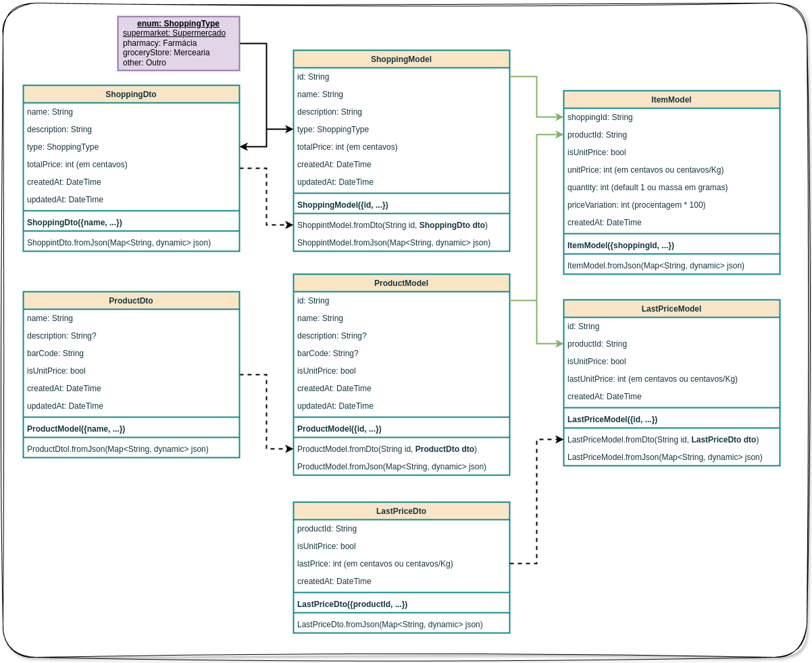
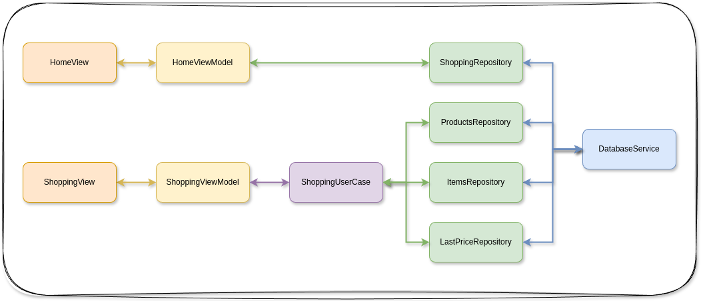

# Compras

Esta aplicação é uma antiga demanda de minha Ex (Jeani Daniela Bortolini) para o controle das compras em mercados, farmácias e outros.

A ideia do aplicativo é registrar os itens comprados e o valor total da compra. Verificar as alterações nos preços dos produtos e de suas compras mensais.

A aplicação será implementada com a arquitetura proposta pelo time do Flutter MVVM.

## Diagrama de Classes

O diagrama de classes abaixo ilustra o padrão de arquitetura utilizado na aplicação.

- **ShoppingModel** representa o modelo de dados da compra, contendo os itens e o valor total.

- **ProductModel** representa o modelo de dados do produto, contendo o nome, descrição, código de barras, parâmetro para indicar que o produto é vendido a unidade ou a quilo. Futuramente estes dados devem ser alimentados por API externa, buscando informações dos produtos em uma base de dados pelo seu código de barras.

- **ItemModel** representa o modelo de dados do item da compra, contendo o produto, a quantidade e o preço unitário.

- **LastPriceModel** representa o modelo de dados do preço do produto, contendo o produto, a data e o preço unitário das últimas compras.

Alguns dtos (Data Transfer Objects) foram criados para facilitar a passagem de informação entre as camadas de domínio e data.

## Arquitetura MVVM

O projeto vai ser desenvolvido com a arquitetura proposta pelo time do Flutter MVVM, em três camadas básicas:

- **Data Layer**: camada para os *repositories* e *services*. 
    - o *repository* é a fonte de verdade (*source of truth*) de dados, mantendo o cache e podendo ser reativo para mudanças nos dados armazenados. 
    - O *service* implementa uma abstração sobre tecnologia da base de dados.
- **Domain Layer**: camada para os *models* e *user-cases*.
    - Os *models* representam os dados que serão armazenados no banco de dados.
    - Os *user-cases* são implementados para:
        - regras de negócio complexas
        - acesso a mais de um *repository*
        - quando um *repository* precisa ser acessados por diversas uis, a fim de evitar duplicação de código.
- **UI Layer**: camada para as *views* e *view-models*.
    - As *views* representam as telas da aplicação.
    - Os *view-models* implementam a lógica de negócio das *views*, conectando as *views* aos *repositories*, ou aos *user-cases* nos casos declarados acima.

Para a implementação são pevistos os dois ramos principais na arquitetura:

1. **DatabaseService <-> ShoppingRepository <-> HomeViewModel <-> HomeView** - neste ramo será gerenciado a view principal do app, onde o usuário pode ver e editar as compras cadastradas.
2. **DatabaseService <-> ProductRepository/ItemsRepository/LastPriceRepository <-> ShoppingViewModel <-> ShoppingView** - neste ramo serão gerenciadas as views de cadastro de compras, cadastro de produtos e cadastro de preços dos produtos durante uma compra.

A ideia é que as compras sejam geristradas e que os itens lançados possam ter seus preços anteriores apresentados durante a inserção, para fim de comparação e levantamento de sua inflação de preços durante a compra.

Para mais detalhes da arquitetura veja o texto em [ARCHITETURE.md](ARCHITECTURE.md) e a documentalção do Flutter Team.

# Changelog

Vejas as alterações no [CHANGELOG.md](CHANGELOG.md)