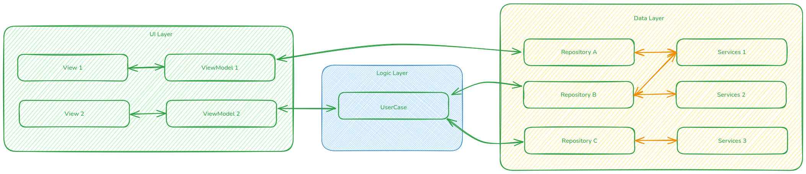
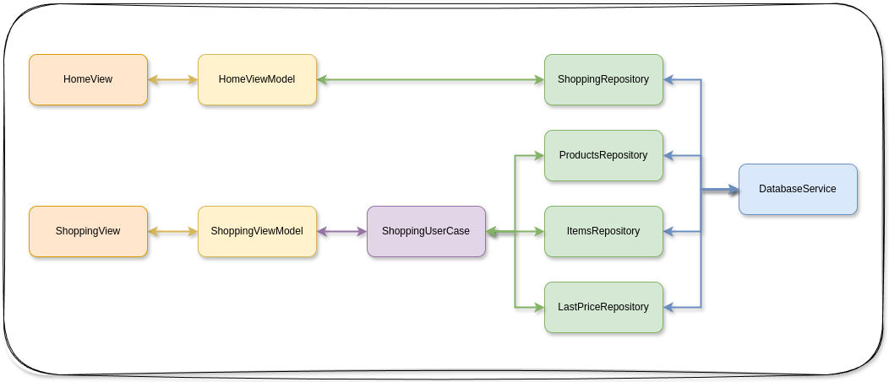

# Arquitetura

A aplicação seguirá o padrão **MVVM**, conforme orientação do Flutter Team, dividida em três grandes camadas:

## 1. Data

Responsável pelo CRUD junto à fonte de dados. Subdividida em:

* **Service**
  Abstrai o servidor de dados e converte o payload bruto em modelos de domínio. Essa camada isola a origem dos dados, facilitando mudanças futuras sem impactar as camadas superiores.
* **Repository**
  Responsável por fornecer os dados ao restante do app, orquestrando chamadas ao Service e mantendo um cache interno dos dados já carregados. O Repository também trabalhará como a *Source of True* dos dados, podendo ser reativo para mudanças nos dados armazenados.

## 2. Domain

Agrupa modelos e regras de negócio:

* **models**
  Declaração de modelos, DTOs e enums da aplicação. Utiliza o `freezed` para geração automática de Data Classes e DTOs.
* **use\_cases**
  Classes que organizam regras de negócio mais complexas ou que envolvem múltiplos repositórios. Para casos simples, a lógica pode permanecer na ViewModel.

## 3. UI

Interface com o usuário e ligação com a lógica de negócio:

* **views**
  Componentes de interface gráfica (telas, widgets, layouts).
* **view\_models**
  Ponte entre as Views e os Repositories/UseCases. Aqui acontece a manipulação de estado e lógica de apresentação; para fluxos muito complexos, a responsabilidade pode ser compartilhada com UseCases.

---

O diagrama abaixo ilustra a arquitetura proposta pelo time do Flutter MVVM.

De uma forma geral os dados serão transitados dos Repositories para as ViewModels e das ViewModels para os Repositories. Os UseCases serão usados para lidar com regras de negócio mais complexas ou que envolvem múltiplos repositórios.

A camada ViewModel irá gerenciar a reatividade por meio do emprego de um Command, encapulando as regras de negócio e a lógica de apresentação.

## Para o MVP (Minimum Viable Product)

Para o MVP o diagrama de classes da aplicação será implementado conforme o diagrama a seguir:

Onde as classes principais são:

### 1. ShoppingModel

Representa o modelo de dados da compra, contendo os dados de uma compra.

* **id** - identificador da compra;
* **name** - nome da compra;
* **description** - descrição da compra;
* **totalPrice** - valor total da compra;
* **type** - tipo da compra (mercado, farmácia, etc.);
* **createdAt** - data de criação da compra;
* **updatedAt** - data de atualização da compra;

### 2. ProductModel

Representa o modelo de dados do produto, contendo os dados de um produto, relacionados ao seu código de barras.

* **id** - identificador do produto;
* **name** - nome do produto;
* **description** - descrição do produto;
* **barCode** - código de barras do produto;
* **saleBy** - indica se o produto é vendido a unidade ou a quilo;
* **categoryName** - categoria do produto;
* **categoryId** - identificador da categoria do produto;
* **subCategoryName** - subcategoria do produto;
* **subCategoryId** - identificador da subcategoria do produto;
* **createdAt** - data de criação do produto;
* **updatedAt** - data de atualização do produto;

### 3. ItemModel

Representa o modelo de dados do item da compra, contendo os dados de um item da compra, como quantidade, preço unitário e produto.

* **shoppingId** - identificador da compra;
* **productId** - identificador do produto;
* **name** - nome do produto;
* **saleBy** - indica se o produto é vendido a unidade ou a quilo;
* **unitPrice** - preço unitário do produto;
* **quantity** - quantidade do produto;
* **priceVariation** - variação do preço do produto;
* **createdAt** - data de criação do item da compra;
* **updatedAt** - data de atualização do item da compra;

### 4. LastPriceModel

Esta classe será responsável por manter registros dos valores de compra dos produtos, conforme a data de compra, para facilitar a visualização de variações nos preços dos produtos ao longo do tempo.

* **id** - identificador do registro;
* **productId** - identificador do produto;
* **lastUnitPrice** - preço unitário do produto;
* **saleBy** - indica se o produto é vendido a unidade ou a quilo;
* **createdAt** - data de criação do registro;

### 5. CategoryModel

Representa o modelo de dados da categoria, contendo os dados de uma categoria.

* **id** - identificador da categoria;
* **name** - nome da categoria;

### 6. SubCategoryModel

Representa o modelo de dados da subcategoria, contendo os dados de uma subcategoria.

* **id** - identificador da subcategoria;
* **name** - nome da subcategoria;
* **categoryId** - identificador da categoria;

Category e Subcategory serão empregados para a classificação dos produtos e geração de relatórios de variação de preços.

## MVVM para o MVP

Para o MVP o diagrama de classes da implementação do MVVM será implementado conforme o diagrama a seguir:

A HomeView vai manter as listas das compras registradas no aplicativo, sendo responsável por criar novas listas e administrá-las.

A ShoppingView será o responsável por:

* criar novos produtos;
* criar novos registros de preços;
* lançar itens nos carrinhos.

Por isto que este último interage com a ShoppingUserCase, para gerenciar os itens da compra nos diferentes repositórios: ProductRepository, ItemsRepository e LastPriceRepository.
